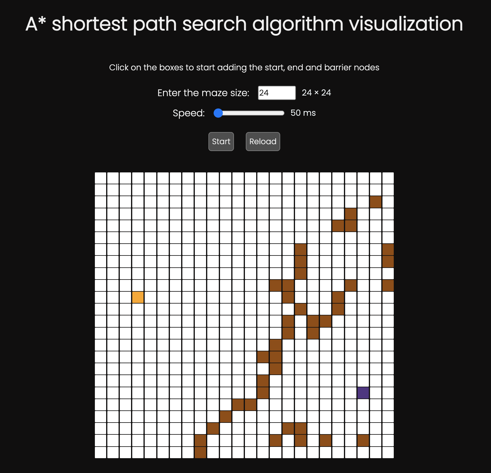
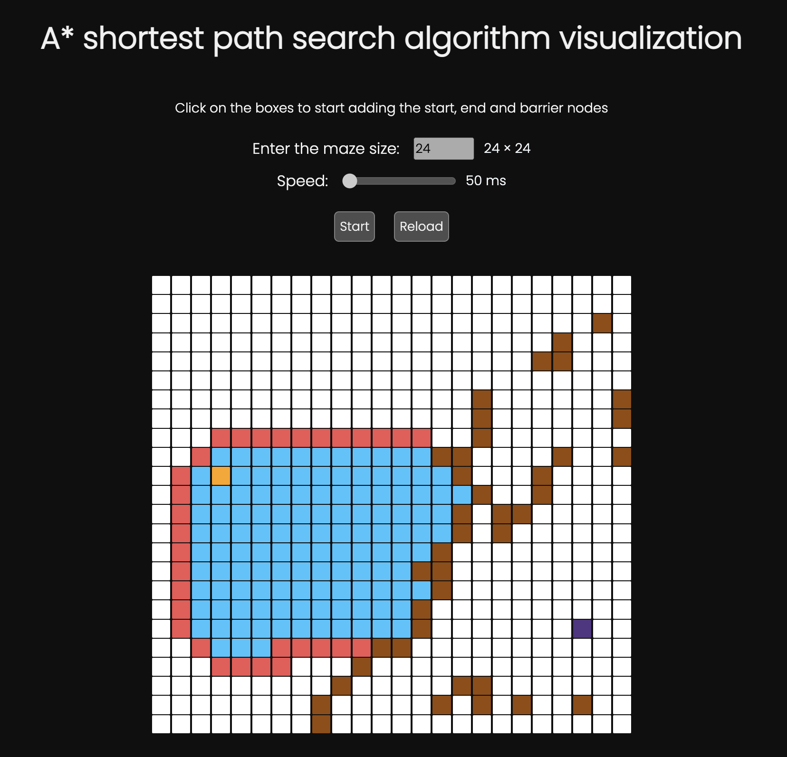
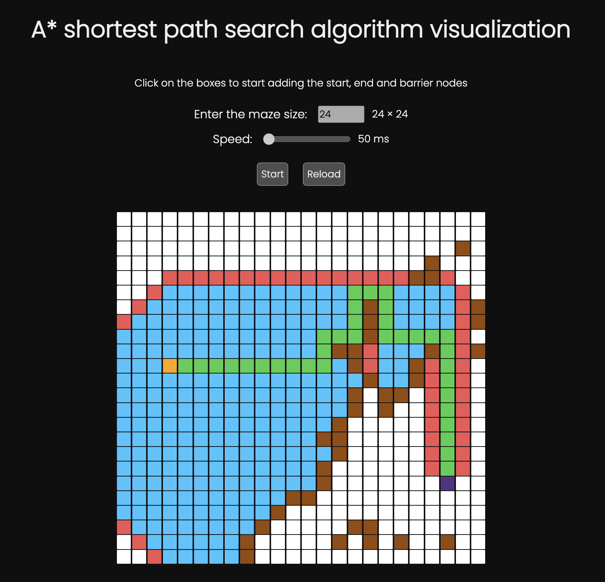

# React - A\* Shortest Path Search Algorithm - Visualization

<!-- [Click here to view the application]() -->

## About the algorithm

A* Search Algorithm is one of the best and popular technique used in path-finding and graph traversals. Unlike Dijkstra’s algorithm, A* search algorithm is much more efficient as it also considers its current position from the end node while traversal. [Click here](https://github.com/prtvi/mso/#about-the-a-search-algorithm) to read more about the algorithm.

## About the project

In this application, you can use various grid sizes and also adjust the visualization speed.
You first set the grid size and then set the visualization speed.

Now you click on the boxes to first set the `start node` 🟧 then the `end node` 🟪. Then you start adding the `barrier nodes` 🟫.
Reference to different types of nodes is given in the legend below.

Now click on the start button to start the visualization.

## Output

### Here are some snapshots from the visualization:

1: Start, end node and barriers set, algorithm to be started

 

2: Halfway of the algorithm running

 

3: The end result, the shortest path highlighted in green 🟩

 

### Legend

⬜️ Reset (default unset node)  
🟧 Start node  
🟪 End node  
🟫 Barrier node  
🟦 Open node (traversing yet possible over this node)  
🟥 Closed node (no more traversing will happen on this node)  
🟩 Path (shortest path found)  
